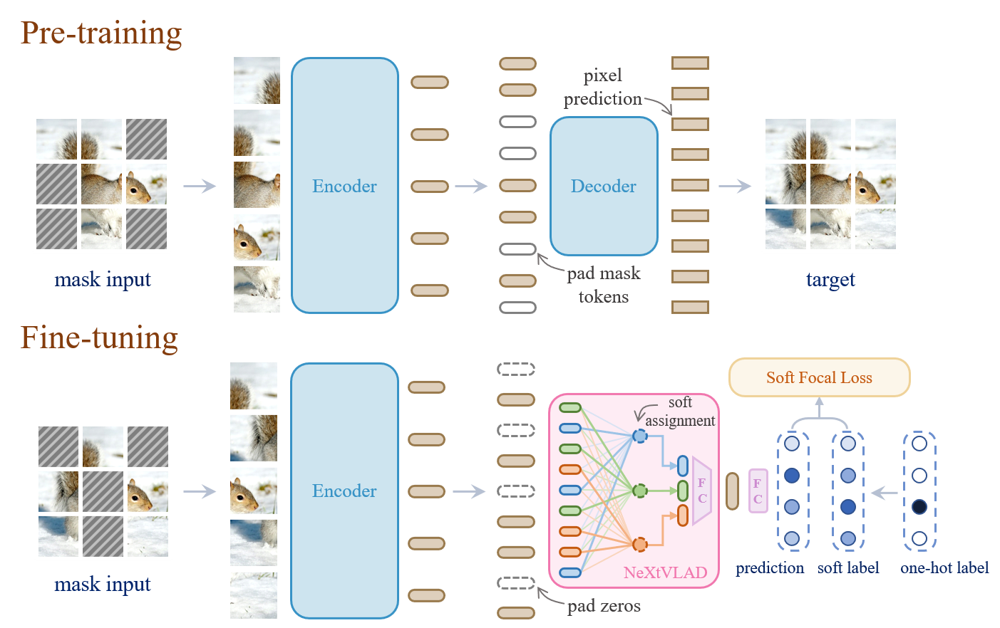

# ECCV-22 TransVLAD: A PyTorch Implementation

<!--  -->
<div align=center>
  
</div>

- This is a PyTorch/GPU Implementation of the paper [TransVLAD: Focusing on Locally Aggregated Descriptors for Few-Shot Learning](http).
- Our code is mainly based on the [unofficial PyTorch implementation of MAE](https://github.com/pengzhiliang/MAE-pytorch) publised before official implementation available. And the few-shot learning setting is based on the [meta-baseline repo](https://github.com/yinboc/few-shot-meta-baseline).  We really appreciate their precious works!

## Dependencies

System

```bash
ubuntu 20.04
python 3.8.12
cuda 11.0
```

Packages

```bash
torch==1.10.0
torchvision==0.11.1
timm==0.4.12
einops==0.3.2
numpy
```

## Datasets

Dataset can be downloaded from [here](https://huggingface.co/datasets/pancake/few_shot_dataset/tree/main).

Including:

- *miniImageNet*. It contains 100 classes with 600 images in each class, which are built upon the ImageNet dataset. The 100 classes are divided into 64, 16, 20 for meta-training, meta-validation and meta-testing, respectively.
- *tieredImageNet*. TieredImageNet is also a subset of ImageNet, which includes 608 classes from 34 super-classes. Compared with miniImageNet, the splits of meta-training(20), meta-validation(6) and meta-testing(8) are set according to the super-classes to enlarge the domain difference between training and testing phase. The dataset also include more images for training and evaluation.
- *CIFAR-FS*. CIFAR-FS is divided from CIFAR-100, which consists of 60,000 images in 100 categories. The CIFAR-FS is divided into 64, 16 and 20 for training, validation, and evaluation, respectively.
- *FC100*. FC100 is also divided from CIFAR-100, which is more difficult because it is more diverse. The FC100 uses a split similar to tieredImageNet, where train, validation, and test splits contain 60, 20, and 20 classes.
- *CUB*. CUB-200-2011 (CUB) is a fine-grained dataset of 200 bird species with total 11,788 images. It is is randomly divided into three disjoint sets of the training set (100 classes), validation set (50 classes), and testing set (50 classes).

**Theses datasets shoud be uncompressed into TransVLAD/data/datasets/.**

The file structure should be as follows:

``` sh
TransVLAD/
├── data/
│   ├── datasets/
│   │   ├── CIFAR_FS/
│   │   ├── cub/
│   │   ├── FC100/
│   │   ├── mini-imagenet/
│   │   ├── tiered_imagenet/
│   ├── pretrain_models/
├── datasets/
├── engines/
├── models/
├── output/
├── utils/
├── ...
├── LICENSE
├── README.md
```

## Training

Pre-train a MAE encoder for few-shot learning (1600 epoch). We follow the unofficial implementation with normalized pixels as the target to predict.  Our pretrain models can be downloaded from [here](https://huggingface.co/datasets/pancake/TransVLAD_pretrain_models/tree/main).

- `--no_normlize_target` if you want to visualize image restoration like MAE original paper, you should add it to the script.

```bash
bash pretrain.sh
```

Fine-tune TransVLAD on a few-shot dataset (100 epoch).

- `--focal_gamma` is the focusing parameter in soft focal loss;
- `--meta_distance cos` means using cosine similarity to measure features' distance;
- `--meta_val` means validating in few-shot testing way.

```bash
bash finetune.sh
```

## Testing

<!--  -->
<div align=center>
  
</div>

Meta-testing is the few-shot standard testing way. Cross-domain few-shot testing can be simply done by testing the model on another dataset different from the dataset used in the training phase.

```bash
bash test.sh
```

## Results

Average experimental results of TransVLAD on few-shot classification.

<table>
  <tr>
    <td>datasets</td>
    <td colspan="2" align="center">miniImageNet</td>
    <td colspan="2" align="center">tieredImageNet</td>
  </tr>
  <tr>
    <td>setting</td>
    <td>5-way 1-shot</td>
    <td>5-way 5-shot</td>
    <td>5-way 1-shot</td>
    <td>5-way 5-shot</td>
  </tr>
  
  <tr>
    <td>accuracy</td>
    <td align="center">68.24</td>
    <td align="center">84.42</td>
    <td align="center">77.20</td>
    <td align="center">90.74</td>
  </tr>
</table>

<table>
  <tr>
    <td>datasets</td>
    <td colspan="2" align="center">CIFAR-FS</td>
    <td colspan="2" align="center">FC100</td>
    <td colspan="2" align="center">CUB</td>
  </tr>
  <tr>
    <td>setting</td>
    <td>5-way 1-shot</td>
    <td>5-way 5-shot</td>
    <td>5-way 1-shot</td>
    <td>5-way 5-shot</td>
    <td>5-way 1-shot</td>
    <td>5-way 5-shot</td>
  </tr>
  <tr>
    <td>accuracy</td>
    <td align="center">77.48</td>
    <td align="center">89.82</td>
    <td align="center">47.66</td>
    <td align="center">64.25</td>
    <td align="center">82.66</td>
    <td align="center">92.45</td>
  </tr>
</table>

We perform a t-SNE visualization of embeddings generated by Meta-Baseline, MAE++ (MAE adds masked fine-tuning and soft focal loss), and our TransVLAD (MAE ++ adds NeXtVLAD module) on the test set of miniImageNet.


We observe that our methods, both MAE++ and TransVLAD, produce more compact features for the same class. Besides, TransVLAD only adds the NeXtVLAD module compared to MAE++, and apparently gets a more discriminative feature distribution with larger boundaries between clusters. We hypothesize that this behavior is due to the learned cluster centers of NeXtVLAD. Features are guided to be close to those related centers.
